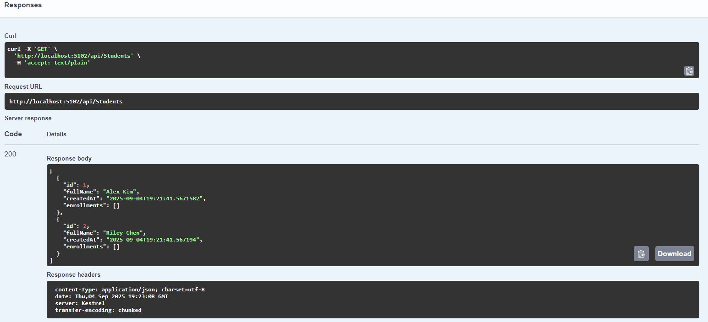

# 📚 CoursePlanner API

A simple **ASP.NET Core Web API** project for managing students, courses, and enrollments.  
The project demonstrates:

- C# 12 / .NET 9
- ASP.NET Core Web API
- Entity Framework Core with SQLite
- Dependency Injection (DI)
- CRUD operations
- Swagger for API docs
- xUnit tests
- Docker support



---

## Getting Started

### Prerequisites
- [.NET 9 SDK](https://dotnet.microsoft.com/download/dotnet/9.0)
- [SQLite](https://www.sqlite.org/download.html) (optional, DB is auto-created)
- [Docker](https://www.docker.com/) (optional, for containerized runs)

---

### Project Structure
```
courseplanner/
├─ CoursePlanner.sln
├─ src/
│  └─ CoursePlanner.Api/           # Web API project
│     ├─ Controllers/              # API controllers (Students, Courses, Enrollments)
│     ├─ Data/                     # EF Core DbContext + Seed
│     ├─ Models/                   # Entity classes
│     ├─ Services/                 # Business logic interfaces & implementations
│     ├─ Properties/               # launchSettings.json
│     ├─ Migrations/               # EF Core migrations
│     └─ Dockerfile
└─ tests/
   └─ CoursePlanner.Tests/         # Unit tests (xUnit)
```

---

## Run Locally

```bash
# Restore dependencies
dotnet restore

# Apply migrations and create DB
dotnet ef database update

# Run the API
dotnet run --project src/CoursePlanner.Api
```

API should now be available at:

- Swagger UI → [http://localhost:5102/swagger](http://localhost:5102/swagger)
- Sample endpoint → `GET http://localhost:5102/weatherforecast`

---

## Database

- Uses **SQLite** (`CoursePlanner.db`).
- Entities:
  - `Student` – basic student record
  - `Course` – (to be implemented)
  - `Enrollment` – join entity (many-to-many, to be implemented)

### Migrations
```bash
# Add a migration
dotnet ef migrations add <MigrationName>

# Apply latest migration
dotnet ef database update

# Drop database (dev only)
dotnet ef database drop -f
```

---

## Features

**Students**
- `GET /api/students` → List all students
- `GET /api/students/{id}` → Get one student
- `POST /api/students` → Create student
- `PUT /api/students/{id}` → Update student
- `DELETE /api/students/{id}` → Delete student

**Courses** *(to be added)*
- CRUD for courses

**Enrollments** *(to be added)*
- Add/remove student from a course
- List students per course
- List courses per student

---

## Testing

```bash
dotnet test
```

- Uses **xUnit** + **EF Core InMemory** for fast, isolated tests.
- Example: `StudentServiceTests` verifies CRUD works correctly.

---

## Docker

Build and run container:

```bash
# Build image
docker build -t courseplanner-api ./src/CoursePlanner.Api

# Run container
docker run -p 8080:8080 courseplanner-api
```

API available at → [http://localhost:8080/swagger](http://localhost:8080/swagger)

---

## Next Steps

- [ ] Build **Course** model, service, and controller
- [ ] Build **Enrollment** model, service, and controller
- [ ] Add tests for new services
- [ ] Seed sample courses + enrollments
- [ ] Add Angular frontend to consume API (optional)

---

## Learning Goals

This project is meant as a crash course to get exposure to:

- C# syntax and OOP
- ASP.NET Core Web APIs
- Dependency Injection in practice
- EF Core + migrations
- REST + Swagger docs
- Testing with xUnit
- Dockerized deployment

---

Author: *Blake Simpson*  
Goal: Learn C#/.NET ecosystem while practicing API development
